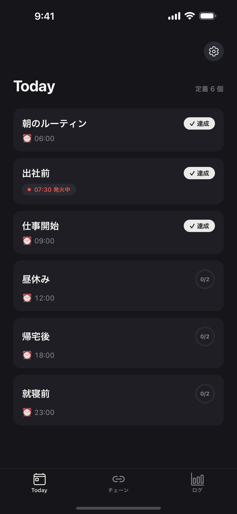

# knockon

If-Then で行為を連ねる「チェーン」を中心にした習慣づけアプリ。

[App Store で見る](https://apps.apple.com/jp/app/knockon/id6796213204)



---

## チェーンとは

起点となる**アンカー**に、**アクション**を順に連ねたものです。

```
[ 朝 7:00 ]  ← アンカー（時刻・場所・行動のいずれか）
    │
    ├─ コーヒーを淹れる
    │
    ├─ ストレッチ
    │
    └─ 今日の予定を確認
```

アンカーはチェーンに1つだけ。2番目以降のトリガーは「直前のアクションが終わったこと」なので、UI にも出しません。「◯◯をしたら、次は△△」という連鎖そのものがデータ構造になっています。

前のアクションに新しい習慣を紐づけて定着を促すやり方は、Gollwitzer の実行意図（If-Then プランニング）の概念を参考にしています。

## 技術スタック

- React Native / Expo (expo-router)
- TypeScript
- expo-sqlite（記録内容は端末内で完結）
- expo-notifications / expo-location（OS 標準ジオフェンス。有料 API 不要）
- PostHog（匿名の利用統計とエラー情報のみ）

## 開発方針

- **ADR で設計判断を記録する** — 出荷したあとに撤回したもの（連続日数の表示 = [ADR-0036](docs/decisions/0036-rescind-today-streak-display.md)、達成マトリクス = [ADR-0051](docs/decisions/0051-remove-matrix-and-merge-fresh-into-growing.md)）も、撤回に至った経緯ごと `docs/decisions/` に残しています。マトリクスは実機で使った違和感が撤回の起点でした
- **保存するのは事実のみ、解釈は表示時の派生** — 達成率・連続日数・定着判定といった集計値を持たないため、機能追加の多くがデータ移行なしで行えます（[ADR-0001](docs/decisions/0001-chain-data-model.md)）
- **テストと CI** — ドメイン層と永続化層をテストで固め、CI で型チェックと全テストをブロッキングにしています。UI と通知まわりはリリース前の実機 QA でカバー
- **AI エージェントを開発フローの中核に置く** — 運用の考え方は [nokku-ops-architecture](https://github.com/nokku-dev/nokku-ops-architecture) を参照

## ドキュメント

| ファイル | 内容 |
|---|---|
| [SPEC.md](SPEC.md) | プロダクト定義・データモデル・ビュー構成・v1 非スコープ |
| [PLAN.md](PLAN.md) | フェーズ分割と早期検証ゲート（実機で数日使うまで設計を広げない） |
| [DESIGN-SYSTEM.md](DESIGN-SYSTEM.md) | カラー / タイポグラフィのトークン、スパイン・マーカー・モーションの語彙、禁止 UI と変更時の規律 |
| [docs/decisions/](docs/decisions/) | ADR |
| [KNOWLEDGE.md](KNOWLEDGE.md) | 実装・運用で得た知見のログ |

## サポート・法務

- [プライバシーポリシー](https://legal.nokku.dev/knockon/privacy)
- [利用規約](https://legal.nokku.dev/knockon/terms)
- お問い合わせ: support@nokku.dev

## ライセンス

MIT — [LICENSE](LICENSE) を参照。
