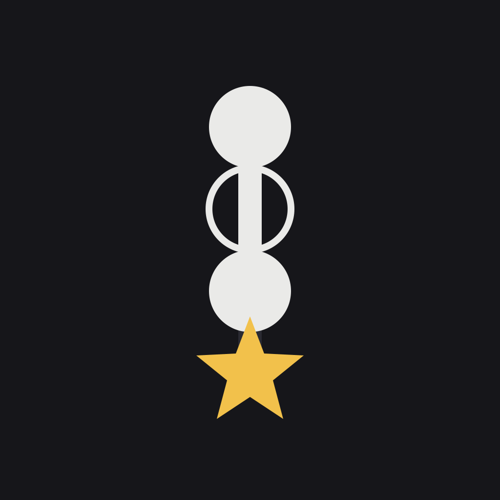
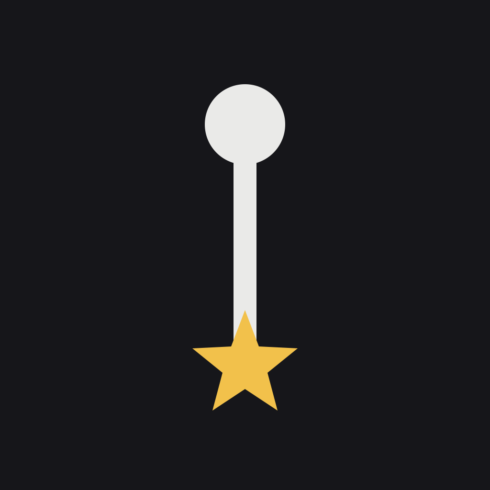
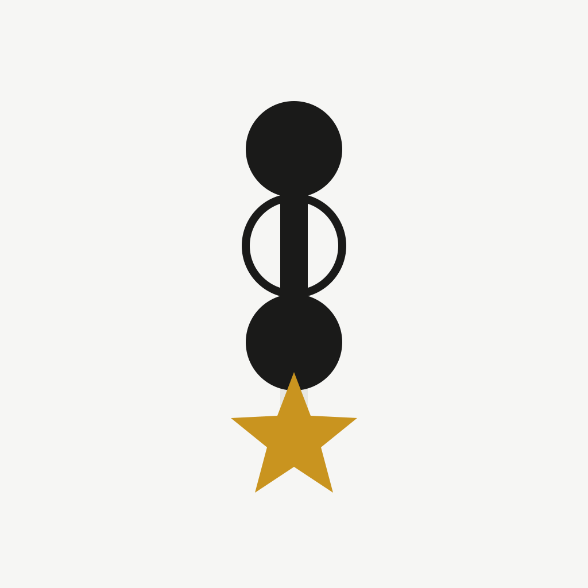
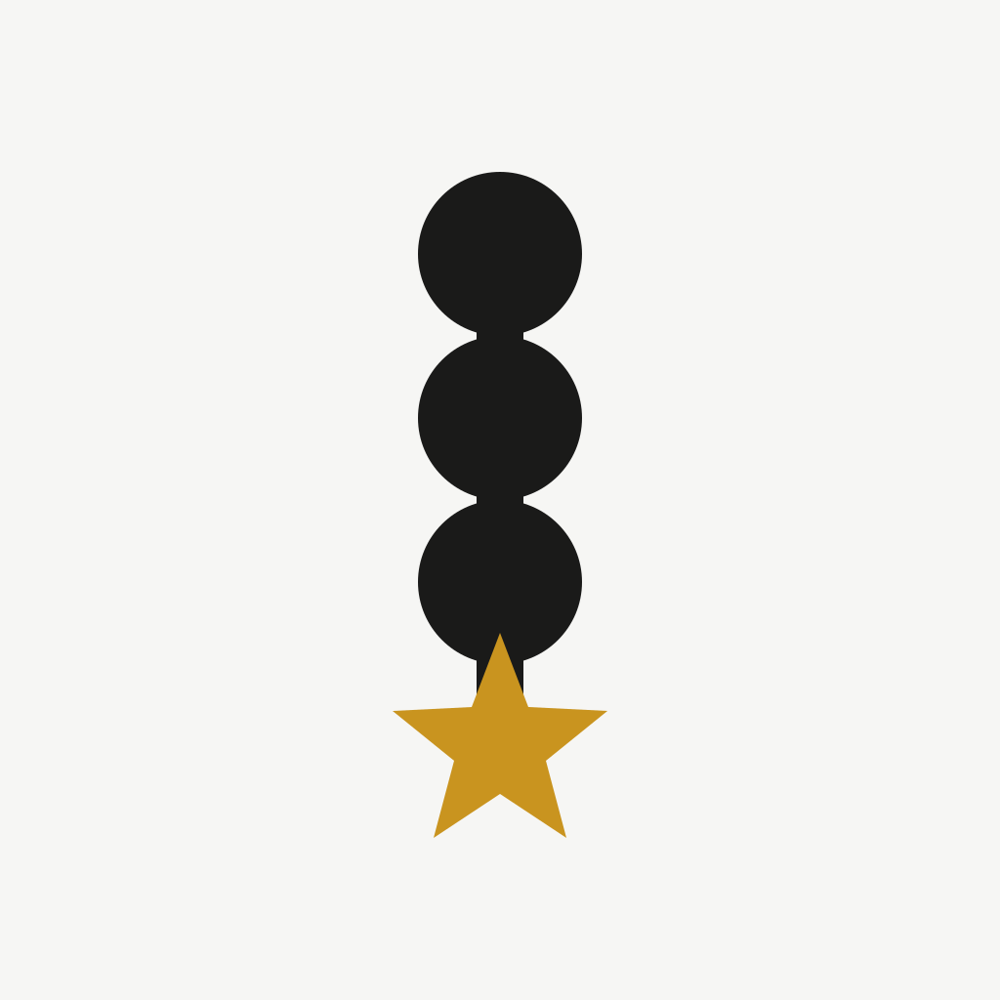
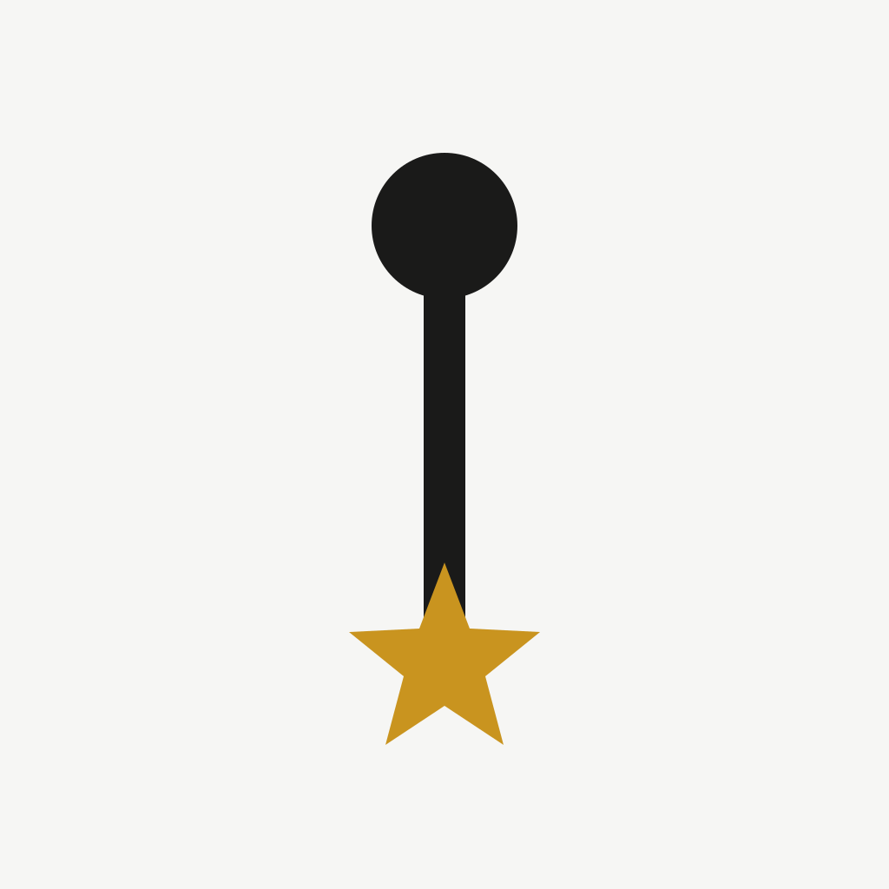
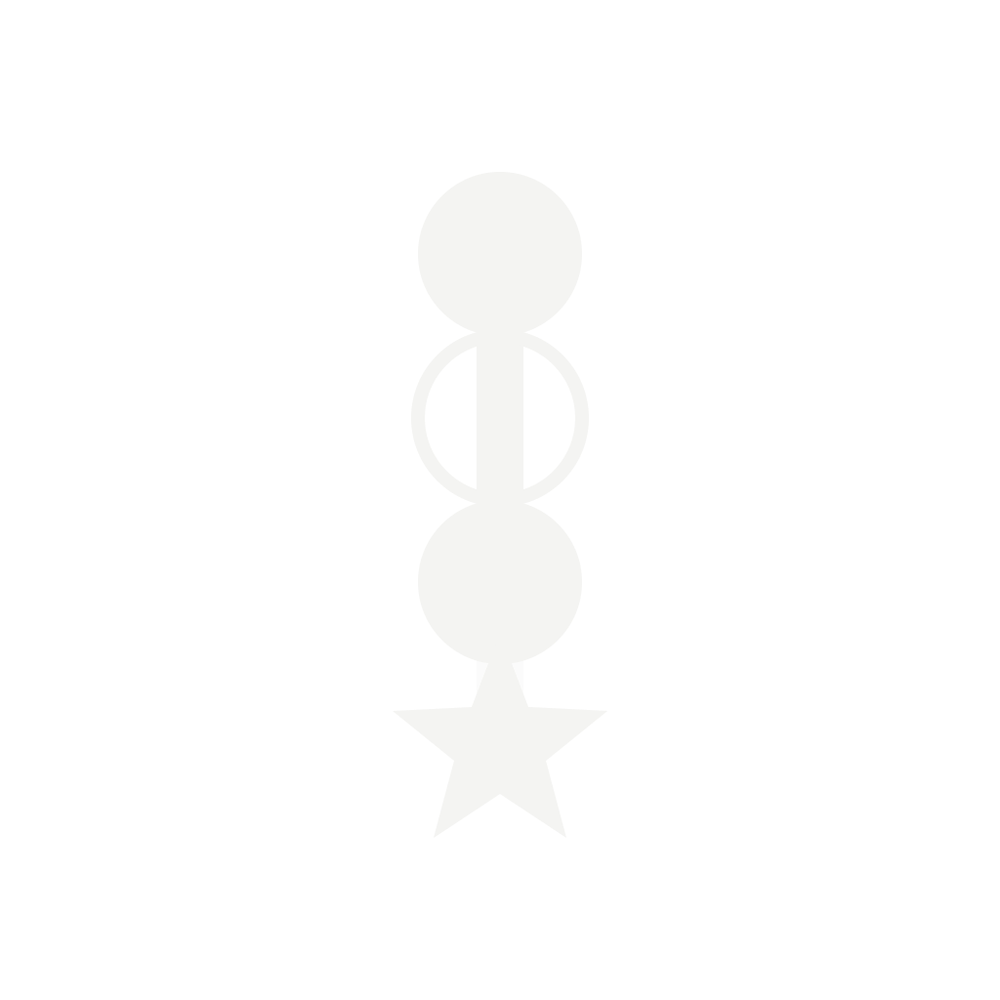
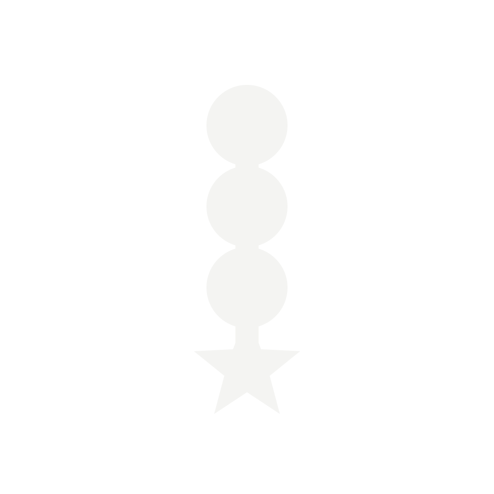
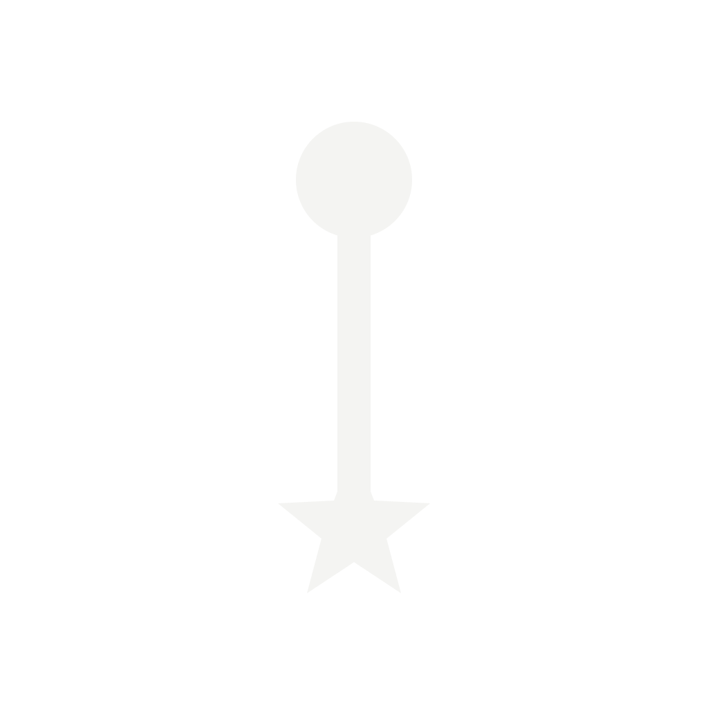

# knockon アプリアイコン モチーフ SVG モックアップ

Issue [#231](https://github.com/nokku-dev/knockon/issues/231) の成果物。親 Issue [#222](https://github.com/nokku-dev/knockon/issues/222) で採用された **Motif A（縦スパイン + 起点アンカー + ノード + 星）** の変奏 3 案 (A-1 / A-2 / A-3) を SVG として作成し、`1024²` 実サイズ + 32px 相当の縮小 + themed monochrome + Light 壁紙上の見え方を並べて共有する。

**このディレクトリはあくまで探索用モックアップ**。App Store 用の最終アイコン (`assets/` 配下配置 + `app.json` 更新) は別 Issue [#223](https://github.com/nokku-dev/knockon/issues/223) で仕上げる。ここで A-1 / A-2 / A-3 のどれを本命にするかを Taku が視覚判断で確定する。

## 前提

- 採用モチーフ ([#222 comment](https://github.com/nokku-dev/knockon/issues/222#issuecomment-5081449329)): **Motif A** (縦スパイン + アンカー + 積み上がるノード + 末尾に星)。認知性は抽象度高めで ★★★☆☆ のトレードオフを許容。
- ブランドの核 ([`DESIGN-SYSTEM.md §0`](../../../DESIGN-SYSTEM.md) / [ADR-0004](../../decisions/0004-design-direction-v02.md)): 積み上がる 1 本の連続スパイン。格子 / ヒートマップ / ストリーク炎 / 紙吹雪 / 波紋 / 弱い輪 は禁止。
- 星の記号論 ([ADR-0050](../../decisions/0050-settlement-star-marker-and-today-headline.md)): 定着 = 塗り星 (5 芒星)、塗り分けなし。inner:outer = 0.42 (アプリの実装値 `STAR_INNER_R = MARKER_RADIUS * 0.42` を踏襲)。
- カラートークン ([`src/tokens.ts`](../../../src/tokens.ts)): dark bg `#16161A` / grow `#EAEAE8` / line-bg `#2A2A32` / star `#F2C14B`。Light bg `#F6F6F4` / dark `#1A1A19` / star `#C9941F`。
- キャンバス: 1024² (iOS App Store 要件)。スパイン線の端点は y=260〜764 (縦 504 px) だが、**可視コンテンツの外接 bbox は y=176〜858 (縦 682 px ≒ キャンバスの 66.6%)** ─ 起点アンカー円 (`cy=260 r=84` → 上端 y=176) と星ポリゴン (下端頂点 y=858) を含めた実測値。Android adaptive icon の safe zone (66% = 1024×0.66 ≒ 676 px、y=174〜850) に対し、**星の下端 y=858 が safe zone 下端 y=850 を 8 px はみ出す**。SVG モックアップの段階では本ディレクトリ内での視覚判断を優先しこのまま提示し、実配布アイコンでは Issue [#223](https://github.com/nokku-dev/knockon/issues/223) の PNG 書き出し / Android adaptive foreground 生成時にコンテンツ全体を数 % 縮小 (例: 98% スケール) して safe zone 内に収める。

## 3 変奏の位置付け ([#227 レビュー](https://github.com/nokku-dev/knockon/issues/227#issuecomment-5041575567) 反映)

| 変奏 | 意味 | 訴求点 | リスク |
|---|---|---|---|
| **A-1** | 起点 + 未達 (○) + 達成 (●) + 星 | 「積み上がる**過程**」を見せる (今まさに進行中) | 中間の未達 (○) が Celebrate 主・(−) 禁則 (ADR-0036) と微妙に緊張 |
| **A-2** | 起点 + 達成 3 個 + 星 (線が最後まで grow) | 「**到達**した完成形」を見せる | 「積み上がりの過程」が消える |
| **A-3** | 起点 + 星 のみ (極ミニマル) | 32px でも潰れない小サイズ最適解 / themed 化最強 | 「積み上がる」というプロダクトの核が線 1 本に減る |

A-4 (45° 傾け) は [#227 レビュー](https://github.com/nokku-dev/knockon/issues/227#issuecomment-5041575567) の穴 §2 で「§4.1『起点アンカーが上端、下へ流れる 1 本の連続線』が崩れて汎用チェックマーク化する」と指摘があったため、本モックアップから**除外**。左右パディング (背景オフセット) 一択の吸収策で縦長を吸収する。

E (横並び連鎖) / F (扉) も [#227 提案](https://github.com/nokku-dev/knockon/issues/227) 時点で却下済みのため本モックアップは作らない。

## 1024² 実サイズ

### Dark 背景 (Dark 固定運用中 / [DESIGN-SYSTEM.md §1](../../../DESIGN-SYSTEM.md) の 2026-07-07 現状)

| A-1 (中間) | A-2 (完成形) | A-3 (極ミニマル) |
|---|---|---|
|  |  |  |

### Light 背景 (iOS Home Screen で白壁紙に置かれる想定)

| A-1 (中間) | A-2 (完成形) | A-3 (極ミニマル) |
|---|---|---|
|  |  |  |

### Themed monochrome (Android 13+ / 通知アイコン用)

| A-1 (中間) | A-2 (完成形) | A-3 (極ミニマル) |
|---|---|---|
|  |  |  |

> 星の暖色 `#F2C14B` が themed 化で消えるため、星の意味論 (Celebrate) はモノクロだと**形 (5 芒星 vs 円)** のみで区別されることになる。A-3 は「アンカーの円 vs 星」の 2 形状で最も読みやすく、A-1 は 3 形状 (塗り円 / 白抜き円 / 星) を並べるので判別コストが上がる。

## 32px 相当 (小サイズ視認性の確認)

App Store 検索一覧・iOS 通知アイコン (実効 20-30px) を想定した縮小レンダリング。SVG そのままを HTML の `width` で 32px に縮めているため実際のバンドルアイコンより滑らかだが、線の太さとマーカーの識別性を素早く比べる用途に使う。

<table>
  <thead>
    <tr>
      <th>変奏</th>
      <th>Dark 32px</th>
      <th>Light 32px</th>
      <th>Mono 32px</th>
    </tr>
  </thead>
  <tbody>
    <tr>
      <td>A-1</td>
      <td></td>
      <td></td>
      <td></td>
    </tr>
    <tr>
      <td>A-2</td>
      <td></td>
      <td></td>
      <td></td>
    </tr>
    <tr>
      <td>A-3</td>
      <td></td>
      <td></td>
      <td></td>
    </tr>
  </tbody>
</table>

参考として 128px 相当 (Home Screen フォルダ内・Spotlight 検索の実効サイズ):

<table>
  <thead>
    <tr>
      <th>変奏</th>
      <th>Dark 128px</th>
      <th>Light 128px</th>
      <th>Mono 128px</th>
    </tr>
  </thead>
  <tbody>
    <tr>
      <td>A-1</td>
      <td></td>
      <td></td>
      <td></td>
    </tr>
    <tr>
      <td>A-2</td>
      <td></td>
      <td></td>
      <td></td>
    </tr>
    <tr>
      <td>A-3</td>
      <td></td>
      <td></td>
      <td></td>
    </tr>
  </tbody>
</table>

## 判定軸 (Taku が最終選択で使う)

[#227 提案](https://github.com/nokku-dev/knockon/issues/227) の 5 軸フレーム + [#227 レビュー](https://github.com/nokku-dev/knockon/issues/227#issuecomment-5041575567) 穴 §5-§6 で追加が必要と指摘された軸を統合:

1. **ブランド固有性** — 縦スパイン + マーカーの純度がどれだけ伝わるか
2. **小サイズ視認性** — 32px 相当で線 + マーカーが識別できるか
3. **モノクロ耐性** — themed 化で色が消えても意味が残るか
4. **白壁紙上での塊感** — iOS Home Screen (壁紙 = 白 / 写真) で「四角い黒シルエット」に見えないか
5. **反 streak / Celebrate 主整合** — 未達 (○) や比率が指差しにならないか

### 事前所感 (SVG レンダリング後の Taku 判断待ち)

- **A-1** はブランド説明力が最高だが、中間の白抜き円 (○) がアイコンとして常設されると (−) 禁則 ([ADR-0036 §一般原則](../../decisions/0036-rescind-today-streak-display.md)) と緊張する。特に mono 版では 3 形状 (塗り / 白抜き / 星) の判別コストが上がる。
- **A-2** は完成形なので Celebrate 主に忠実。ただし「積み上がる過程」を静止画では見せられず、A のブランド説明力の一部が削がれる。
- **A-3** は極ミニマルで小サイズ視認性 / モノクロ耐性が最も強い。**通知アイコン / themed icon の必需フォールバック**として A-1 or A-2 とセットで検討する価値がある。

### 選定ガイド (推奨判断ツリー)

1. Home Screen の主アイコン (A-1 or A-2) を先に決める:
    - 「アイコン自体をブランド説明に使いたい」→ **A-1**
    - 「Celebrate 主 (反 streak / (−) 禁則) を最優先」→ **A-2**
2. 通知アイコン / themed icon は **A-3** を採用 (mono 版は形状 3 種より 2 種の方が強い)
3. 選定後は Issue [#223](https://github.com/nokku-dev/knockon/issues/223) で:
    - 選ばれた 1 案の PNG バリアント (1024² + iOS 端末サイズセット + Android adaptive foreground/background 分離) を書き出し
    - `assets/` に配置 + `app.json` の `icon` / `ios.icon` / `android.adaptiveIcon` / `expo-notifications` プラグイン参照を更新
    - Xcode プロジェクト (`ios/knockon/Images.xcassets/AppIcon.appiconset/`) に組み込み
    - モチーフ確定を [`branding`](../../decisions/README.md) タグの ADR として起票 ([#227 レビュー](https://github.com/nokku-dev/knockon/issues/227#issuecomment-5041575567) 穴 §7 の nokku 頭文字衝突リスク確認は Motif C 復帰時に扱う)

## 認知テスト (N=1 前提)

[#227 レビュー](https://github.com/nokku-dev/knockon/issues/227#issuecomment-5041575567) 穴 §9 の指摘に応じ、被験者と方法を先出しする:

- 被験者: **Taku 1 人** (SPEC §0 の N=1 完成判定に合わせる)
- 方法:
    1. 本 README を Home Screen / iPhone のスクショと隣り合わせで見る
    2. 32px 表 → 128px 表 → 1024² 表の順で「まだ knockon と識別できるか」を口頭確認
    3. 他人 N の追加は初期リリースでは行わない (Store 順位を狙うフェーズに入ってから)

## 追跡

- 親: [#222 (Design task)](https://github.com/nokku-dev/knockon/issues/222) — Motif A 採択済み
- 提案: [#227 (Proposal)](https://github.com/nokku-dev/knockon/issues/227) — 6 モチーフ探索 + レビュー
- 本 Issue: [#231](https://github.com/nokku-dev/knockon/issues/231) — SVG モックアップ生成 (本 PR)
- 次: [#223](https://github.com/nokku-dev/knockon/issues/223) — 選定後の最終アイコン書き出し + `app.json` / Xcode 反映
