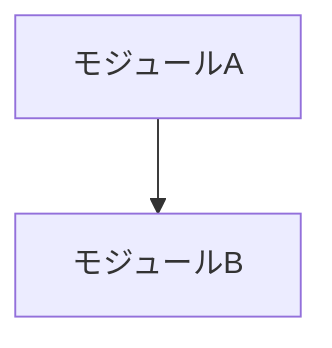

# Understanding Map

このプロジェクトの全体像を維持するための骨格チェックリスト。
/map スキルで更新。週次程度の頻度を想定。

## 把握済み

<!-- 自分が腹落ちしている領域 -->

## 未把握・要確認

<!-- まだ腹落ちしていない領域。優先的に理解を深めるべき -->

## アーキテクチャの主要な判断

<!-- なぜこの構成にしたか。後から「なんでこうなってるの？」と思った時に参照する -->

## 依存関係・外部サービス

<!-- 外部API、SDK、サービスとの接続点 -->

## アーキテクチャ図

<!-- /map スキルが Mermaid 記法で生成・更新する。手動で編集してもよい。

-->
