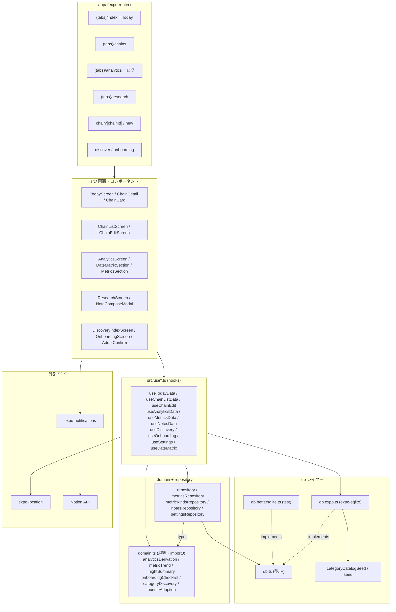
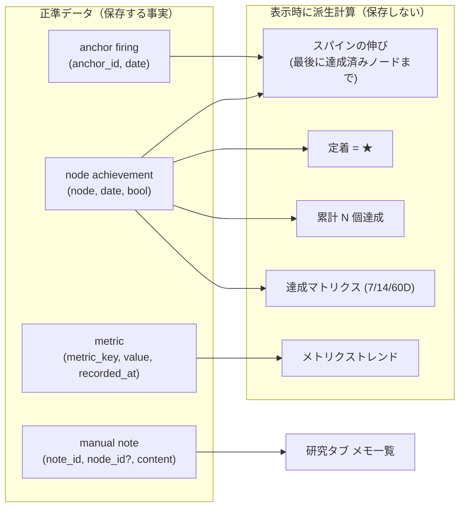

# Understanding Map

このプロジェクトの全体像を維持するための骨格チェックリスト。
/map スキルで更新。週次程度の頻度を想定。

> 最終更新: 2026-06-30（SPEC v0.4 / ADR-0044 #181〜#189 時点）。
> prime objective = **自分が毎日使う1本を最短で完成・出荷する**。完成判定 = Phase 1（Today が実機で数日回る）。

## 把握済み

<!-- 自分が腹落ちしている領域。← 認識が違えば「未把握」へ動かす -->

- **正準データ5軸**: ノード達成 `(node, date, bool)` / アンカー発火 `(anchor_id, date)` / メトリクス `(metric_key, value, recorded_at)` / 手動メモ `(note_id, node_id?, content, …)` / 定着取り下げ `(node_id, retracted_at)`。派生値（連鎖の流れ・定着判定・進捗率・星種別）は一切保存せず表示時に派生計算（ADR-0001 / 0012 / 0024 / 0044 / 0047）。定着は生涯マイルストーン(latch)だが派生のまま。定着ノードは Today で **左ドットが星型**（ADR-0050、#118「常に円」を反転）・**タップ従来どおり**（星は達成と別軸のマイルストーン記号、auto-✓ #211 撤回・レコードは実タップのみ・K-002）。定着=星は Today ドット/7D/60Dマトリクスに通底。**Today 見出しは「定着 N 個」**（#213 effective 累計は撤回）。取り下げ導線＝定着ノード長押しメニュー + ログ定着ポートフォリオ（#205）。ステージは**3段（育成中/もう少しで定着/定着）**（ADR-0051 で「これから」を育成中に統合）+週次流入、0件でも見出し常時表示。**60D/7D マトリクスは ADR-0051 で撤去**（未達＝ギャップを指差すため・コード残置）。
- **チェーンモデル**: 起点アンカー1つ＋ノード順序列。中間アンカーなし。v1 ノードはアクションのみ（サブチェーン参照は非スコープ・後から無移行で追加可）。旧「リンク＝アンカー×アクション」モデルは破棄済み。
- **ゆるい連鎖判定**: ノードを飛ばしても各ノード独立達成。後続をゼロ評価しない（ADR-0002）。
- **反 streak / Celebrate 主**: 連続日数は計算も表示もしない（#123 で #103 撤回）。手応えは「伸びるスパイン」と「定着＝小さな★」のみ。数字/グリフ追加の判定軸＝「失われうるか (+/-)」（ADR-0036 §一般原則）。
- **レイヤー構成**: `app(画面) → hooks(use*) → repository + domain → db`。`domain.ts` は import ゼロの純粋関数（DB/UI/状態管理に非依存・K-007）。
- **DB の3バックエンド分離**: `db.ts`（型/インターフェース）/ `db.expo.ts`（実機 expo-sqlite）/ `db.bettersqlite.ts`（テスト用 better-sqlite3）。
- **ビュー4タブ**: Today（最重要）/ チェーン / ログ（**定着ポートフォリオ**＝これから/育成中/定着のステージ別、ADR-0047 で率ダッシュボードから組み替え・v1表示に復活）/ 研究（手動メモ一覧＋FAB）。
- **発火ロジック**: Today に並ぶ＝ active な全チェーンのノード。アンカーは通知＋「発火中」ピルのための分類軸（ADR-0020 で旧「手動発火」概念は廃止）。場所発火は OS 標準ジオフェンス（有料 API 不要）。

## 未把握・要確認

<!-- まだ腹落ちしていない領域。優先的に理解を深めるべき -->

- **窓（ウィンドウ）の目的別固定値**: Today カード/詳細スパイン/定着 = 14D、Today ノード行ミニマトリクス = 7D、分析マトリクス = 60D、累計 = 全期間（ADR-0037 / 0038 / 0041）。「同じ目的に複数窓を持たない」原則の境界が曖昧になりやすい。
- **メトリクス層（Phase 3 統合）の ANT 違反回避が構造的に効いているか**: 「任意 + チェーンと疎結合 + 連携 read-only」で K-004 を回避する設計（ADR-0024）。実機運用での検証が前提。
- **Notion メトリクス同期** (`notionClient` / `notionMetricsSync` / `notionConfig`): 接続点と失敗時挙動の腹落ち。
- **カテゴリカタログ移行の残骸**: 旧 module/link 層は撤去済み（#160）だが、catalog seed・discovery・onboarding の新カテゴリモデル（ADR-0039）への移行が全画面で一貫しているか。
- **未解決の設計前提（SPEC §2 留意）**: ゆるい判定が「連鎖が遵守を生む」便益を薄める可能性。Phase 1 実使用で観察する論点。

## アーキテクチャの主要な判断

<!-- なぜこの構成にしたか -->

| 判断 | 内容 | ADR |
| --- | --- | --- |
| スタック | Expo (React Native) managed + EAS Build。time-to-device 最優先 | 0007 |
| ナビ | expo-router ファイルベース。`app/` が画面構成、Bottom Tabs | 0011 |
| 永続化 | expo-sqlite ローカル正準、同期なし。`(node,date,bool)` 等のみ保存 | 0001 |
| 描画 | react-native-svg で1本連続スパイン | 0009 / 0010 |
| 発火 | OS 標準ジオフェンス（有料地図 API 禁止）。手動発火概念は廃止 | 0003 / 0020 |
| 通知 | expo-notifications（ローカルのみ）。夜の達成サマリ 21:00 一本 | 0019 / 0042 |
| 連鎖判定 | ゆるい（各ノード独立達成） | 0002 |
| データ正準 | 派生値非保存。観測した事実のみ5軸（+定着取り下げ） | 0001 / 0012 / 0024 / 0044 / 0047 |
| 反 streak | 連続日数を出さない。判定軸「失われうるか (+/-)」 | 0036 |
| 定着ライフサイクル | 生涯マイルストーン(latch・派生)＋取り下げ事実軸。ログ=定着ポートフォリオ、率撤去 | 0047 |
| マイグレーション | 非破壊（FK 列削除は table-copy）。schema は user_version 管理 | 0016 / 0027 |
| カテゴリモデル | module/link → カテゴリ2型へ再構築、旧層撤去 | 0039 / 0040 |
| メトリクス/分析 | 目標ビューと統合し Phase 3 で v1 範囲に取り込み | 0024 |
| リセット時刻 | 日付境界 = 設定可能な reset time。`app_settings` シングルトン | 0028 |

## 依存関係・外部サービス

<!-- 外部API、SDK、サービスとの接続点 -->

- **expo-sqlite** — ローカル正準 DB（`db.expo.ts`）。テストは better-sqlite3（`db.bettersqlite.ts`）。
- **expo-location** — region monitoring（ジオフェンス・`location.ts`）。
- **expo-notifications** — ローカル通知（`notifications.ts` / `notificationHelpers.ts` / `notificationsDeeplink.ts` / `nightSummary.ts`）。
- **react-native-svg** — スパイン描画（`ChainDetail` / `LineChart` / `ProgressRing` / `MetricTrendChart`）。
- **@gorhom/bottom-sheet** — Today の ChainDetail Bottom Sheet。
- **Notion API** — メトリクス同期（`notionClient.ts` / `notionConfig.ts` / `notionMetricsSync.ts`）。任意・read-only 寄り。
- **EAS Build** — Dev Client apk / preview apk / production ビルド（ADR-0017）。

## アーキテクチャ図

